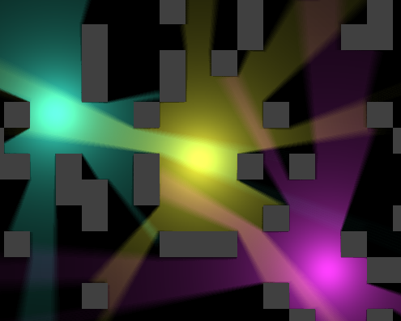

# C Raycast Shadows
This project utilizes code from my [C Raycasting repository](https://github.com/FuzzyCat444/C-Raycasting) as well as my [C Laser Physics repository](https://github.com/FuzzyCat444/C-Laser-Physics) to create a shadow effect using the [DDA raycasting algorithm](https://en.wikipedia.org/wiki/Digital_differential_analyzer_(graphics_algorithm)).

